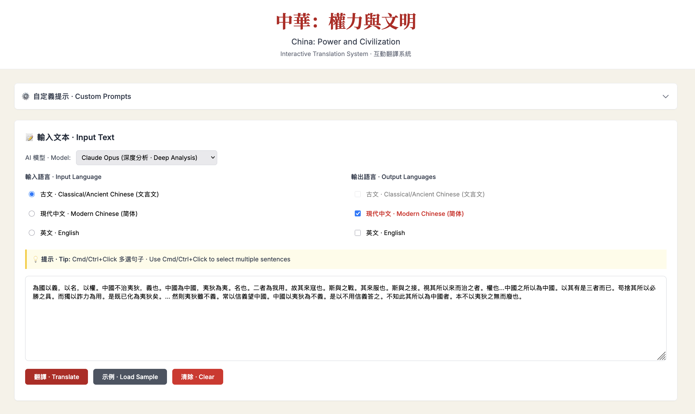
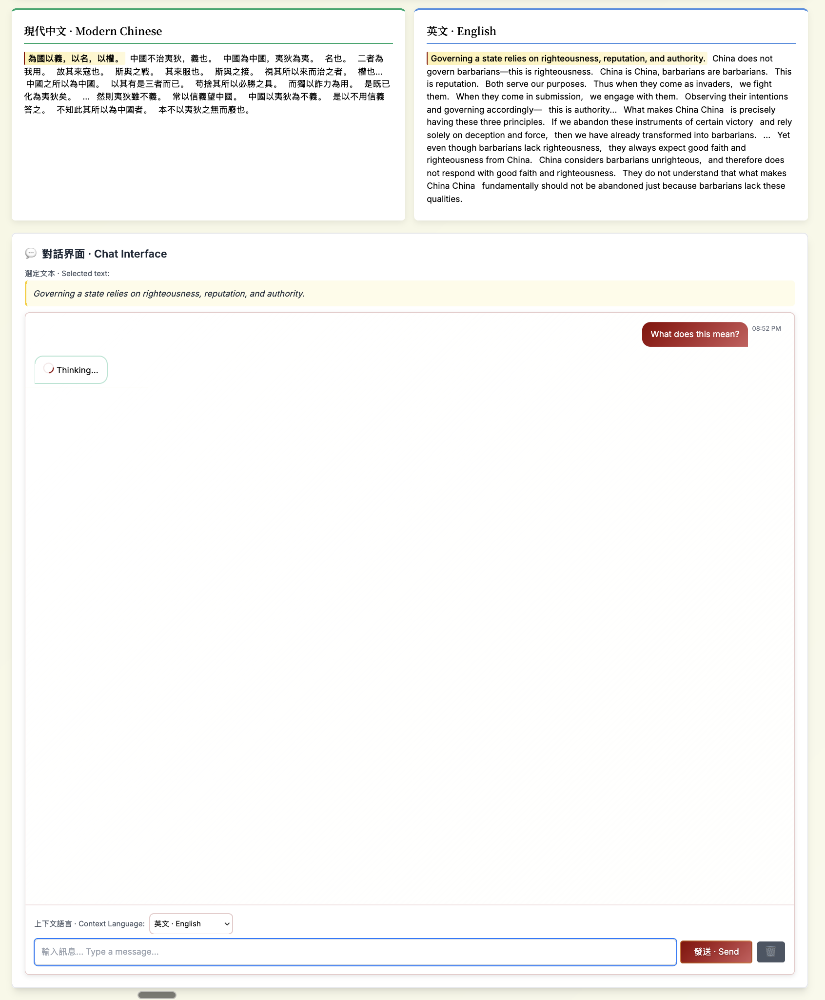

# China: Power and Civilization - Interactive Translation System
# 中華文明 · 互動翻譯系統

Hi! This repo is the result of some basic Claude Code coding that I think led to a really delightful interface!

It rose out of an assignment in [GENED1136](https://ealc.fas.harvard.edu/gen-ed-1136-power-and-civilization-china), where we were given a passage of ancient Chinese text:

> 為國以義，以名，以權。中國不治夷狄，義也。中國為中國，夷狄為夷。名也。二者為我用。故其來寇也。斯與之戰。其來服也。斯與之接。視其所以來而治之者。權也…中國之所以為中國。以其有是三者而已。苟捨其所以必勝之具。而獨以詐力為用。是既已化為夷狄矣。… 然則夷狄雖不義。常以信義望中國。中國以夷狄為不義。是以不用信義答之。不知此其所以為中國者。本不以夷狄之無而廢也。

As both an English and a Chinese speaker, I thought that it would be really cool if we had a better interface than a simple chatbot in comparing these translations, with better ways of interrogating the text than a linear chat interface.

So I built this out!

## 📸 Screenshots

### Input Screen


### Translation Interface


You can translate between Ancient Chinese, Modern Chinese, and English freely, display the translation side by side, and chat with the translated text. The translated text is naturally segmented into sentences, and clicking on any text highlights the correct sentence on all versions of the same text! Further, you can highlight multiple sentences and use it as context to chat with an LLM to engage deeper with the material :).

Currently, I only support the Claude Code SDK with Opus/Sonnet but it should be easily extensible.

## 🚀 Installation

1. Install dependencies:
```bash
npm install
```

2. Start the server:
```bash
npm start
```

3. Open your browser to:
```
http://localhost:3001
```

## 🏗️ Technical Architecture

### Backend (`server.js`)
- Express server with three main endpoints:
  - `/api/segment-and-translate`: Processes text with XML sentence markers
  - `/api/query-claude`: Handles AI queries using Claude Code SDK
  - Model selection support for both endpoints

### Frontend (`index.html`)
- Single-page application with vanilla JavaScript
- Dynamic panel generation based on language selection
- Multi-sentence selection with Set-based state management
- Chinese-inspired CSS with custom properties for theming

### Translation Process
1. Text segmented into sentences with XML markers (`<s1>`, `<s2>`, etc.)
2. Full context maintained for accurate translation
3. Parallel display with synchronized sentence alignment
4. Support for Classical Chinese particles (之, 乎, 者, 也, etc.)

## 🔧 API Reference

### POST /api/segment-and-translate
Request:
```json
{
  "text": "Input text",
  "inputLanguage": "ancient|modern|english",
  "outputLanguages": ["ancient", "modern", "english"],
  "model": "opus|sonnet"
}
```

Response:
```json
{
  "original": {
    "language": "ancient",
    "text": "<s1>sentence1</s1><s2>sentence2</s2>..."
  },
  "translations": {
    "modern": "<s1>translation1</s1><s2>translation2</s2>...",
    "english": "<s1>translation1</s1><s2>translation2</s2>..."
  }
}
```

### POST /api/query-claude
Request:
```json
{
  "originalText": "Full original text",
  "highlightedSentence": "Selected sentence(s)",
  "userQuestion": "User's question",
  "model": "opus|sonnet"
}
```

Response:
```json
{
  "response": "Claude's detailed analysis"
}
```

## 🎨 Design Philosophy

The system combines traditional Chinese aesthetics with modern UX principles:
- **Colors**: Deep reds, golds, and jade greens inspired by Chinese art
- **Typography**: Noto Serif SC for Classical Chinese, clean sans-serif for modern text
- **Layout**: Balanced, harmonious arrangement reflecting Chinese design principles
- **Interactions**: Smooth transitions and subtle animations for professional feel

## 📚 Sample Text

The included `translate_this_text.txt` contains a Classical Chinese philosophical text about governance and the relationship between China (中國) and foreign peoples (夷狄), exploring concepts of righteousness (義), reputation (名), and adaptability (權).

## 🛠️ Dependencies

- `express`: Web server framework
- `@anthropic-ai/claude-code`: Claude Code SDK for AI integration
- `cors`: Cross-origin resource sharing
- `dotenv`: Environment variable management

## 🤝 Contributing

This is an educational project for exploring Classical Chinese texts and translation technology. Contributions that enhance the translation accuracy, UI/UX, or educational value are welcome.

---

*Powered by Claude AI · 中西合璧 · Bridging Ancient Wisdom and Modern Technology*
